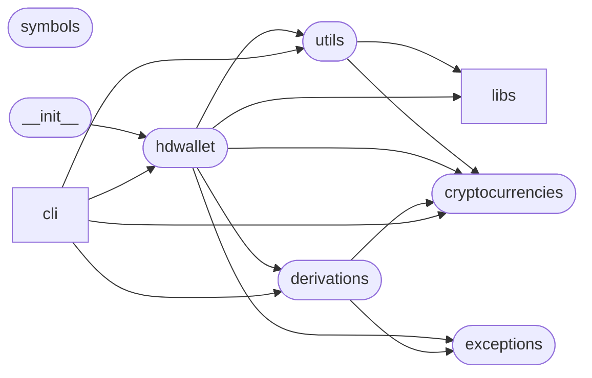

# Code Overview

[_Documentation generated by Documatic_](https://www.documatic.com)

<!---Documatic-section-Codebase Structure Python-start--->
## Codebase Structure Python

The codebase has a 2-deep folder structure,
                with 21 code files in total.

<!---Documatic-block-system_architecture-start--->

<!---Documatic-block-system_architecture-end--->

# #
<!---Documatic-section-Codebase Structure Python-end--->

<!---Documatic-section-Key Objects-start--->
## Key Objects

There are exposed imports at level-0
from the source directory (hdwallet)

<!---Documatic-block-hdwalle-start--->

	
<code>hdwalle</code> (Click to Expand!)

* `hdwallet.hdwallet.BIP141HDWallet`
* `hdwallet.hdwallet.BIP32HDWallet`
* `hdwallet.hdwallet.BIP44HDWallet`
* `hdwallet.hdwallet.BIP49HDWallet`
* `hdwallet.hdwallet.BIP84HDWallet`
* `hdwallet.hdwallet.HDWallet`

<!---Documatic-block-hdwalle-end--->

# #
<!---Documatic-section-Key Objects-end--->

<!---Documatic-section-Important Functions-start--->
## Important Functions

<!---Documatic-block-important_funcs-start--->
<!---Documatic-block-most_used_funcs-start--->
### Most Utilised Functions

* [hdwallet.cryptocurrencies.get_cryptocurrency](5-hdwallet_cryptocurrencies.md#hdwallet.cryptocurrencies.get_cryptocurrency) (4 times)
* [hdwallet.libs.base58.check_decode](7-hdwallet_libs.md#hdwallet.libs.base58.check_decode) (2 times)
* [hdwallet.utils.generate_mnemonic](3-hdwallet_utils.md#hdwallet.utils.generate_mnemonic) (2 times)
* [hdwallet.libs.ripemd160.ripemd160](7-hdwallet_libs.md#hdwallet.libs.ripemd160.ripemd160) (1 times)
* [hdwallet.libs.bech32.bech32_encode](7-hdwallet_libs.md#hdwallet.libs.bech32.bech32_encode) (1 times)
* [hdwallet.libs.bech32.encode](7-hdwallet_libs.md#hdwallet.libs.bech32.encode) (1 times)
* [hdwallet.libs.bech32.bech32_decode](7-hdwallet_libs.md#hdwallet.libs.bech32.bech32_decode) (1 times)
* [hdwallet.libs.bech32.decode](7-hdwallet_libs.md#hdwallet.libs.bech32.decode) (1 times)
* [hdwallet.libs.base58.check_encode](7-hdwallet_libs.md#hdwallet.libs.base58.check_encode) (1 times)
* [hdwallet.libs.base58.checksum_encode](7-hdwallet_libs.md#hdwallet.libs.base58.checksum_encode) (1 times)
* [hdwallet.libs.base58.ensure_string](7-hdwallet_libs.md#hdwallet.libs.base58.ensure_string) (1 times)
* [hdwallet.utils.get_bytes](3-hdwallet_utils.md#hdwallet.utils.get_bytes) (1 times)
* [hdwallet.utils.is_entropy](3-hdwallet_utils.md#hdwallet.utils.is_entropy) (1 times)
* [hdwallet.utils.is_mnemonic](3-hdwallet_utils.md#hdwallet.utils.is_mnemonic) (1 times)
* [hdwallet.utils.get_entropy_strength](3-hdwallet_utils.md#hdwallet.utils.get_entropy_strength) (1 times)
* [hdwallet.utils._unhexlify](3-hdwallet_utils.md#hdwallet.utils._unhexlify) (1 times)
* [hdwallet.utils.is_root_xpublic_key](3-hdwallet_utils.md#hdwallet.utils.is_root_xpublic_key) (1 times)
* [hdwallet.utils.get_mnemonic_language](3-hdwallet_utils.md#hdwallet.utils.get_mnemonic_language) (1 times)
* [hdwallet.utils.is_root_xprivate_key](3-hdwallet_utils.md#hdwallet.utils.is_root_xprivate_key) (1 times)
* [hdwallet.utils.get_mnemonic_strength](3-hdwallet_utils.md#hdwallet.utils.get_mnemonic_strength) (1 times)
* [hdwallet.utils.get_semantic](3-hdwallet_utils.md#hdwallet.utils.get_semantic) (1 times)
* [hdwallet.cli.generate.hdwallet.generate_hdwallet](8-hdwallet_cli.md#hdwallet.cli.generate.hdwallet.generate_hdwallet) (1 times)
* [hdwallet.cli.generate.addresses.generate_addresses](8-hdwallet_cli.md#hdwallet.cli.generate.addresses.generate_addresses) (1 times)
* [hdwallet.cli.list.cryptocurrencies.list_cryptocurrencies](8-hdwallet_cli.md#hdwallet.cli.list.cryptocurrencies.list_cryptocurrencies) (1 times)
* [hdwallet.cli.list.languages.list_languages](8-hdwallet_cli.md#hdwallet.cli.list.languages.list_languages) (1 times)
<!---Documatic-block-most_used_funcs-end--->

<!---Documatic-block-end_user_funcs-start--->
### End User Exposed Functions

* [hdwallet.hdwallet.BIP49HDWallet](4-hdwallet_hdwallet.md#hdwallet.hdwallet.BIP49HDWallet)
* [hdwallet.hdwallet.HDWallet](4-hdwallet_hdwallet.md#hdwallet.hdwallet.HDWallet)
* [hdwallet.hdwallet.BIP32HDWallet](4-hdwallet_hdwallet.md#hdwallet.hdwallet.BIP32HDWallet)
* [hdwallet.hdwallet.BIP141HDWallet](4-hdwallet_hdwallet.md#hdwallet.hdwallet.BIP141HDWallet)
* [hdwallet.hdwallet.BIP84HDWallet](4-hdwallet_hdwallet.md#hdwallet.hdwallet.BIP84HDWallet)
* [hdwallet.hdwallet.BIP44HDWallet](4-hdwallet_hdwallet.md#hdwallet.hdwallet.BIP44HDWallet)
<!---Documatic-block-end_user_funcs-end--->
<!---Documatic-block-important_funcs-end--->

# #
<!---Documatic-section-Important Functions-end--->

<!---Documatic-section-Class Hierarchy-start--->
## Class Hierarchy

<!---Documatic-block-SimpleNamespace-start--->

	
<code>SimpleNamespace</code> (Click to Expand!)

* hdwallet.cryptocurrencies.NestedNamespace

<!---Documatic-block-SimpleNamespace-end--->

<!---Documatic-block-hdwallet.cryptocurrencies.Cryptocurrency-start--->

	
<code>hdwallet.cryptocurrencies.Cryptocurrency</code> (Click to Expand!)

* hdwallet.cryptocurrencies.AnonMainnet
* hdwallet.cryptocurrencies.ArgoneumMainnet
* hdwallet.cryptocurrencies.ArtaxMainnet
* hdwallet.cryptocurrencies.AryacoinMainnet
* hdwallet.cryptocurrencies.AsiacoinMainnet
* hdwallet.cryptocurrencies.AtomMainnet
* hdwallet.cryptocurrencies.AuroracoinMainnet
* hdwallet.cryptocurrencies.AxeMainnet

<!---Documatic-block-hdwallet.cryptocurrencies.Cryptocurrency-end--->

<!---Documatic-block-hdwallet.cryptocurrencies.ExtendedKey-start--->

	
<code>hdwallet.cryptocurrencies.ExtendedKey</code> (Click to Expand!)

* hdwallet.cryptocurrencies.ExtendedPrivateKey
* hdwallet.cryptocurrencies.ExtendedPublicKey

<!---Documatic-block-hdwallet.cryptocurrencies.ExtendedKey-end--->

<!---Documatic-block-hdwallet.cryptocurrencies.NestedNamespace-start--->

	
<code>hdwallet.cryptocurrencies.NestedNamespace</code> (Click to Expand!)

* hdwallet.cryptocurrencies.Cryptocurrency
* hdwallet.cryptocurrencies.ExtendedKey

<!---Documatic-block-hdwallet.cryptocurrencies.NestedNamespace-end--->

# #
<!---Documatic-section-Class Hierarchy-end--->

[_Documentation generated by Documatic_](https://www.documatic.com)