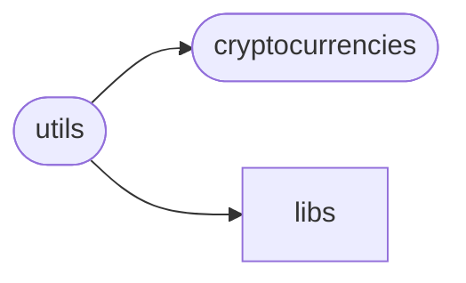
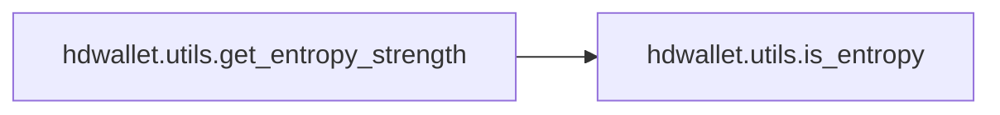
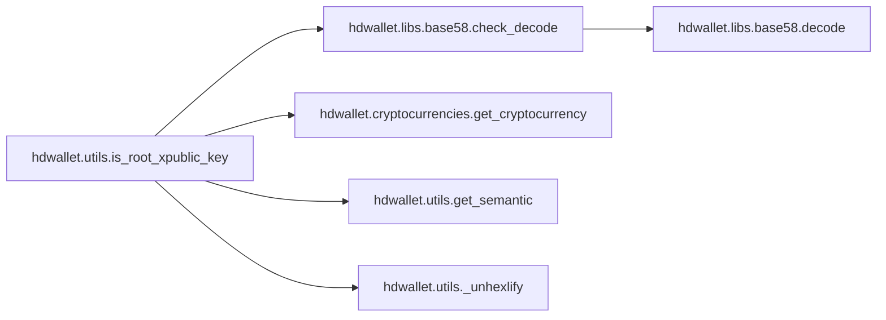
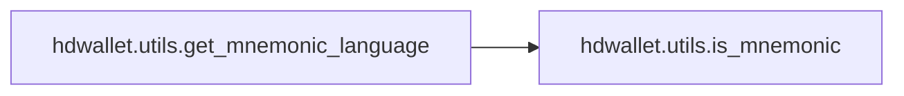
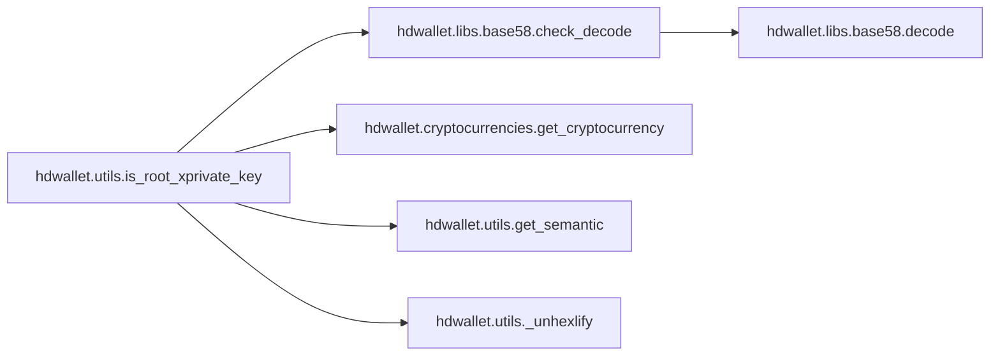
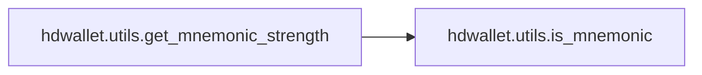

# Hdwallet Utils

[_Documentation generated by Documatic_](https://www.documatic.com)

<!---Documatic-section-Codebase Structure-start--->
## Codebase Structure

<!---Documatic-block-system_architecture-start--->

<!---Documatic-block-system_architecture-end--->

# #
<!---Documatic-section-Codebase Structure-end--->

<!---Documatic-section-hdwallet.utils.generate_mnemonic-start--->
## [hdwallet.utils.generate_mnemonic](3-hdwallet_utils.md#hdwallet.utils.generate_mnemonic)

<!---Documatic-section-generate_mnemonic-start--->
<!---Documatic-block-hdwallet.utils.generate_mnemonic-start--->
<details>
	<summary><code>hdwallet.utils.generate_mnemonic</code> code snippet</summary>

```python
def generate_mnemonic(language: str='english', strength: int=128) -> str:
    if language and language not in ['english', 'french', 'italian', 'japanese', 'chinese_simplified', 'chinese_traditional', 'korean', 'spanish']:
        raise ValueError('invalid language, use only this options english, french, italian, spanish, chinese_simplified, chinese_traditional, japanese or korean languages.')
    if strength not in [128, 160, 192, 224, 256]:
        raise ValueError('Strength should be one of the following [128, 160, 192, 224, 256], but it is not (%d).' % strength)
    return Mnemonic(language=language).generate(strength=strength)
```
</details>
<!---Documatic-block-hdwallet.utils.generate_mnemonic-end--->
<!---Documatic-section-generate_mnemonic-end--->

# #
<!---Documatic-section-hdwallet.utils.generate_mnemonic-end--->

<!---Documatic-section-hdwallet.utils.get_bytes-start--->
## [hdwallet.utils.get_bytes](3-hdwallet_utils.md#hdwallet.utils.get_bytes)

<!---Documatic-section-get_bytes-start--->
<!---Documatic-block-hdwallet.utils.get_bytes-start--->
<details>
	<summary><code>hdwallet.utils.get_bytes</code> code snippet</summary>

```python
def get_bytes(string: AnyStr) -> bytes:
    if isinstance(string, bytes):
        byte = string
    elif isinstance(string, str):
        byte = bytes.fromhex(string)
    else:
        raise TypeError("Agreement must be either 'bytes' or 'string'!")
    return byte
```
</details>
<!---Documatic-block-hdwallet.utils.get_bytes-end--->
<!---Documatic-section-get_bytes-end--->

# #
<!---Documatic-section-hdwallet.utils.get_bytes-end--->

<!---Documatic-section-hdwallet.utils.is_entropy-start--->
## [hdwallet.utils.is_entropy](3-hdwallet_utils.md#hdwallet.utils.is_entropy)

<!---Documatic-section-is_entropy-start--->
<!---Documatic-block-hdwallet.utils.is_entropy-start--->
<details>
	<summary><code>hdwallet.utils.is_entropy</code> code snippet</summary>

```python
def is_entropy(entropy: str) -> bool:
    try:
        return len(unhexlify(entropy)) in [16, 20, 24, 28, 32]
    except:
        return False
```
</details>
<!---Documatic-block-hdwallet.utils.is_entropy-end--->
<!---Documatic-section-is_entropy-end--->

# #
<!---Documatic-section-hdwallet.utils.is_entropy-end--->

<!---Documatic-section-hdwallet.utils.is_mnemonic-start--->
## [hdwallet.utils.is_mnemonic](3-hdwallet_utils.md#hdwallet.utils.is_mnemonic)

<!---Documatic-section-is_mnemonic-start--->
<!---Documatic-block-hdwallet.utils.is_mnemonic-start--->
<details>
	<summary><code>hdwallet.utils.is_mnemonic</code> code snippet</summary>

```python
def is_mnemonic(mnemonic: str, language: Optional[str]=None) -> bool:
    if language and language not in ['english', 'french', 'italian', 'japanese', 'chinese_simplified', 'chinese_traditional', 'korean', 'spanish']:
        raise ValueError('invalid language, use only this options english, french, italian, spanish, chinese_simplified, chinese_traditional, japanese or korean languages.')
    try:
        mnemonic = unicodedata.normalize('NFKD', mnemonic)
        if language is None:
            for _language in ['english', 'french', 'italian', 'chinese_simplified', 'chinese_traditional', 'japanese', 'korean', 'spanish']:
                valid = False
                if Mnemonic(language=_language).check(mnemonic=mnemonic) is True:
                    valid = True
                    break
            return valid
        else:
            return Mnemonic(language=language).check(mnemonic=mnemonic)
    except:
        return False
```
</details>
<!---Documatic-block-hdwallet.utils.is_mnemonic-end--->
<!---Documatic-section-is_mnemonic-end--->

# #
<!---Documatic-section-hdwallet.utils.is_mnemonic-end--->

<!---Documatic-section-hdwallet.utils.get_entropy_strength-start--->
## [hdwallet.utils.get_entropy_strength](3-hdwallet_utils.md#hdwallet.utils.get_entropy_strength)

<!---Documatic-section-get_entropy_strength-start--->


### Object Calls

* [hdwallet.utils.is_entropy](3-hdwallet_utils.md#hdwallet.utils.is_entropy)

<!---Documatic-block-hdwallet.utils.get_entropy_strength-start--->
<details>
	<summary><code>hdwallet.utils.get_entropy_strength</code> code snippet</summary>

```python
def get_entropy_strength(entropy: str) -> int:
    if not is_entropy(entropy=entropy):
        raise ValueError('Invalid entropy hex string.')
    length = len(unhexlify(entropy))
    if length == 16:
        return 128
    elif length == 20:
        return 160
    elif length == 24:
        return 192
    elif length == 28:
        return 224
    elif length == 32:
        return 256
```
</details>
<!---Documatic-block-hdwallet.utils.get_entropy_strength-end--->
<!---Documatic-section-get_entropy_strength-end--->

# #
<!---Documatic-section-hdwallet.utils.get_entropy_strength-end--->

<!---Documatic-section-hdwallet.utils._unhexlify-start--->
## [hdwallet.utils._unhexlify](3-hdwallet_utils.md#hdwallet.utils._unhexlify)

<!---Documatic-section-_unhexlify-start--->
<!---Documatic-block-hdwallet.utils._unhexlify-start--->
<details>
	<summary><code>hdwallet.utils._unhexlify</code> code snippet</summary>

```python
def _unhexlify(integer: int):
    try:
        return unhexlify('0%x' % integer)
    except binascii.Error:
        return unhexlify('%x' % integer)
```
</details>
<!---Documatic-block-hdwallet.utils._unhexlify-end--->
<!---Documatic-section-_unhexlify-end--->

# #
<!---Documatic-section-hdwallet.utils._unhexlify-end--->

<!---Documatic-section-hdwallet.utils.is_root_xpublic_key-start--->
## [hdwallet.utils.is_root_xpublic_key](3-hdwallet_utils.md#hdwallet.utils.is_root_xpublic_key)

<!---Documatic-section-is_root_xpublic_key-start--->


### Object Calls

* [hdwallet.libs.base58.check_decode](7-hdwallet_libs.md#hdwallet.libs.base58.check_decode)
* [hdwallet.cryptocurrencies.get_cryptocurrency](5-hdwallet_cryptocurrencies.md#hdwallet.cryptocurrencies.get_cryptocurrency)
* [hdwallet.utils.get_semantic](3-hdwallet_utils.md#hdwallet.utils.get_semantic)
* [hdwallet.utils._unhexlify](3-hdwallet_utils.md#hdwallet.utils._unhexlify)

<!---Documatic-block-hdwallet.utils.is_root_xpublic_key-start--->
<details>
	<summary><code>hdwallet.utils.is_root_xpublic_key</code> code snippet</summary>

```python
def is_root_xpublic_key(xpublic_key: str, symbol: str) -> bool:
    decoded_xpublic_key = check_decode(xpublic_key)
    if len(decoded_xpublic_key) != 78:
        raise ValueError('Invalid xpublic key.')
    cryptocurrency = get_cryptocurrency(symbol=symbol)
    semantic = get_semantic(_cryptocurrency=cryptocurrency, version=decoded_xpublic_key[:4], key_type='public_key')
    version = cryptocurrency.EXTENDED_PUBLIC_KEY.__getattribute__(semantic.upper())
    if version is None:
        raise NotImplementedError(semantic)
    raw = f'{_unhexlify(version).hex()}000000000000000000'
    return decoded_xpublic_key.hex().startswith(raw)
```
</details>
<!---Documatic-block-hdwallet.utils.is_root_xpublic_key-end--->
<!---Documatic-section-is_root_xpublic_key-end--->

# #
<!---Documatic-section-hdwallet.utils.is_root_xpublic_key-end--->

<!---Documatic-section-hdwallet.utils.get_mnemonic_language-start--->
## [hdwallet.utils.get_mnemonic_language](3-hdwallet_utils.md#hdwallet.utils.get_mnemonic_language)

<!---Documatic-section-get_mnemonic_language-start--->


### Object Calls

* [hdwallet.utils.is_mnemonic](3-hdwallet_utils.md#hdwallet.utils.is_mnemonic)

<!---Documatic-block-hdwallet.utils.get_mnemonic_language-start--->
<details>
	<summary><code>hdwallet.utils.get_mnemonic_language</code> code snippet</summary>

```python
def get_mnemonic_language(mnemonic: str) -> str:
    if not is_mnemonic(mnemonic=mnemonic):
        raise ValueError('Invalid mnemonic words.')
    language = None
    mnemonic = unicodedata.normalize('NFKD', mnemonic)
    for _language in ['english', 'french', 'italian', 'chinese_simplified', 'chinese_traditional', 'japanese', 'korean', 'spanish']:
        if Mnemonic(language=_language).check(mnemonic=mnemonic) is True:
            language = _language
            break
    return language
```
</details>
<!---Documatic-block-hdwallet.utils.get_mnemonic_language-end--->
<!---Documatic-section-get_mnemonic_language-end--->

# #
<!---Documatic-section-hdwallet.utils.get_mnemonic_language-end--->

<!---Documatic-section-hdwallet.utils.is_root_xprivate_key-start--->
## [hdwallet.utils.is_root_xprivate_key](3-hdwallet_utils.md#hdwallet.utils.is_root_xprivate_key)

<!---Documatic-section-is_root_xprivate_key-start--->


### Object Calls

* [hdwallet.libs.base58.check_decode](7-hdwallet_libs.md#hdwallet.libs.base58.check_decode)
* [hdwallet.cryptocurrencies.get_cryptocurrency](5-hdwallet_cryptocurrencies.md#hdwallet.cryptocurrencies.get_cryptocurrency)
* [hdwallet.utils.get_semantic](3-hdwallet_utils.md#hdwallet.utils.get_semantic)
* [hdwallet.utils._unhexlify](3-hdwallet_utils.md#hdwallet.utils._unhexlify)

<!---Documatic-block-hdwallet.utils.is_root_xprivate_key-start--->
<details>
	<summary><code>hdwallet.utils.is_root_xprivate_key</code> code snippet</summary>

```python
def is_root_xprivate_key(xprivate_key: str, symbol: str) -> bool:
    decoded_xprivate_key = check_decode(xprivate_key)
    if len(decoded_xprivate_key) != 78:
        raise ValueError('Invalid xprivate key.')
    cryptocurrency = get_cryptocurrency(symbol=symbol)
    semantic = get_semantic(_cryptocurrency=cryptocurrency, version=decoded_xprivate_key[:4], key_type='private_key')
    version = cryptocurrency.EXTENDED_PRIVATE_KEY.__getattribute__(semantic.upper())
    if version is None:
        raise NotImplementedError(semantic)
    raw = f'{_unhexlify(version).hex()}000000000000000000'
    return decoded_xprivate_key.hex().startswith(raw)
```
</details>
<!---Documatic-block-hdwallet.utils.is_root_xprivate_key-end--->
<!---Documatic-section-is_root_xprivate_key-end--->

# #
<!---Documatic-section-hdwallet.utils.is_root_xprivate_key-end--->

<!---Documatic-section-hdwallet.utils.get_mnemonic_strength-start--->
## [hdwallet.utils.get_mnemonic_strength](3-hdwallet_utils.md#hdwallet.utils.get_mnemonic_strength)

<!---Documatic-section-get_mnemonic_strength-start--->


### Object Calls

* [hdwallet.utils.is_mnemonic](3-hdwallet_utils.md#hdwallet.utils.is_mnemonic)

<!---Documatic-block-hdwallet.utils.get_mnemonic_strength-start--->
<details>
	<summary><code>hdwallet.utils.get_mnemonic_strength</code> code snippet</summary>

```python
def get_mnemonic_strength(mnemonic: str, language: Optional[str]=None) -> int:
    if not is_mnemonic(mnemonic=mnemonic, language=language):
        raise ValueError('Invalid mnemonic words.')
    words = len(unicodedata.normalize('NFKD', mnemonic).split(' '))
    if words == 12:
        return 128
    elif words == 15:
        return 160
    elif words == 18:
        return 192
    elif words == 21:
        return 224
    elif words == 24:
        return 256
```
</details>
<!---Documatic-block-hdwallet.utils.get_mnemonic_strength-end--->
<!---Documatic-section-get_mnemonic_strength-end--->

# #
<!---Documatic-section-hdwallet.utils.get_mnemonic_strength-end--->

<!---Documatic-section-hdwallet.utils.get_semantic-start--->
## [hdwallet.utils.get_semantic](3-hdwallet_utils.md#hdwallet.utils.get_semantic)

<!---Documatic-section-get_semantic-start--->
<!---Documatic-block-hdwallet.utils.get_semantic-start--->
<details>
	<summary><code>hdwallet.utils.get_semantic</code> code snippet</summary>

```python
def get_semantic(_cryptocurrency: Cryptocurrency, version: bytes, key_type: str) -> str:
    for (name, cryptocurrency) in inspect.getmembers(cryptocurrencies):
        if inspect.isclass(cryptocurrency):
            if issubclass(cryptocurrency, cryptocurrencies.Cryptocurrency) and cryptocurrency == _cryptocurrency:
                if key_type == 'private_key':
                    for (key, value) in inspect.getmembers(cryptocurrency.EXTENDED_PRIVATE_KEY):
                        if value == int(version.hex(), 16):
                            return key.lower()
                elif key_type == 'public_key':
                    for (key, value) in inspect.getmembers(cryptocurrency.EXTENDED_PUBLIC_KEY):
                        if value == int(version.hex(), 16):
                            return key.lower()
```
</details>
<!---Documatic-block-hdwallet.utils.get_semantic-end--->
<!---Documatic-section-get_semantic-end--->

# #
<!---Documatic-section-hdwallet.utils.get_semantic-end--->

[_Documentation generated by Documatic_](https://www.documatic.com)