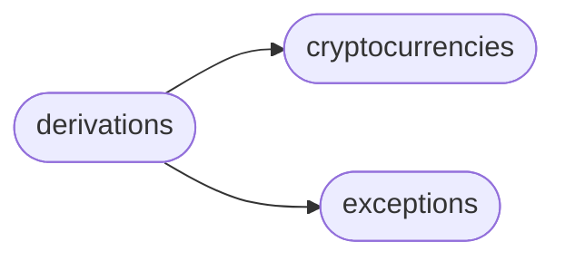

# Hdwallet Derivations

[_Documentation generated by Documatic_](https://www.documatic.com)

<!---Documatic-section-Codebase Structure-start--->
## Codebase Structure

<!---Documatic-block-system_architecture-start--->

<!---Documatic-block-system_architecture-end--->

# #
<!---Documatic-section-Codebase Structure-end--->

<!---Documatic-section-hdwallet.derivations.BIP32Derivation-start--->
## [hdwallet.derivations.BIP32Derivation](6-hdwallet_derivations.md#hdwallet.derivations.BIP32Derivation)

<!---Documatic-section-BIP32Derivation-start--->
<!---Documatic-block-hdwallet.derivations.BIP32Derivation-start--->
<details>
	<summary><code>hdwallet.derivations.BIP32Derivation</code> code snippet</summary>

```python
class BIP32Derivation(Derivation):
    PURPOSE: Tuple[int, bool]
    COIN_TYPE: Tuple[int, bool]
    ACCOUNT: Tuple[int, bool]
    CHANGE: bool
    ADDRESS: Tuple[int, bool]

    def __str__(self):
        if self.PATH == '\x00\x00\x00\x00':
            return f'm/{self.PURPOSE[0]}{(HARDENED[0] if self.PURPOSE[1] else HARDENED[1])}/{self.COIN_TYPE[0]}{(HARDENED[0] if self.COIN_TYPE[1] else HARDENED[1])}/{self.ACCOUNT[0]}{(HARDENED[0] if self.ACCOUNT[1] else HARDENED[1])}/{(1 if self.CHANGE else 0)}/{self.ADDRESS[0]}{(HARDENED[0] if self.ADDRESS[1] else HARDENED[1])}'
        return self.PATH

    def __init__(self, cryptocurrency: Any=None, purpose: Union[int, Tuple[int, bool]]=0, coin_type: Union[int, Tuple[int, bool]]=0, account: Union[int, Tuple[int, bool]]=0, change: bool=False, address: Union[int, Tuple[int, bool]]=0):
        super(BIP32Derivation, self).__init__()
        (self.PURPOSE, self.COIN_TYPE, self.ACCOUNT, self.CHANGE, self.ADDRESS) = (purpose if isinstance(purpose, tuple) else (purpose, True), (cryptocurrency.COIN_TYPE.INDEX, cryptocurrency.COIN_TYPE.HARDENED) if cryptocurrency else coin_type if isinstance(coin_type, tuple) else (coin_type, True), account if isinstance(account, tuple) else (account, True), change, address if isinstance(address, tuple) else (address, False))
        self.SEMANTIC = 'p2pkh'

    def from_purpose(self, purpose: int, hardened: bool=True) -> 'BIP32Derivation':
        """
        Derivation from purpose index.

        :param purpose: Purpose index.
        :type purpose: int
        :param hardened: Hardened, default to ``True``.
        :type hardened: bool

        :returns: BIP32Derivation -- BIP32Derivation instance.

        >>> from hdwallet.derivations import BIP32Derivation
        >>> bip32_derivation = BIP32Derivation()
        >>> bip32_derivation.from_purpose(purpose=0, hardened=True)
        <hdwallet.derivation.BIP32Derivation object at 0x000001E8BFB98D60>
        """
        if self.PATH and self.PATH != '\x00\x00\x00\x00':
            raise DerivationError("When you are using custom path, you can't set purpose.")
        if type(self).__name__ != 'BIP32Derivation':
            raise TypeError(f"You can't set purpose for {type(self).__name__}, it's only for BIP32Derivation class.")
        self.PURPOSE = (purpose, hardened)
        return self

    def from_coin_type(self, coin_type: int, hardened: bool=True) -> 'BIP32Derivation':
        """
        Derivation from Coin Type index.

        :param coin_type: Coin type index.
        :type coin_type: int
        :param hardened: Hardened, default to ``True``.
        :type hardened: bool

        :returns: BIP32Derivation -- BIP32Derivation instance.

        >>> from hdwallet.derivations import BIP32Derivation
        >>> bip32_derivation = BIP32Derivation()
        >>> bip32_derivation.from_coin_type(coin_type=56, hardened=True)
        <hdwallet.derivation.BIP32Derivation object at 0x000001E8BFB98D60>
        """
        if self.PATH and self.PATH != '\x00\x00\x00\x00':
            raise DerivationError("When you are using custom path, you can't set coin type.")
        self.COIN_TYPE = (coin_type, hardened)
        return self

    def from_account(self, account: int, hardened: bool=True) -> 'BIP32Derivation':
        """
        Derivation from Account index.

        :param account: Coin type index.
        :type account: int
        :param hardened: Hardened, default to ``True``.
        :type hardened: bool

        :returns: BIP32Derivation -- BIP32Derivation instance.

        >>> from hdwallet.derivations import BIP32Derivation
        >>> bip32_derivation = BIP32Derivation()
        >>> bip32_derivation.from_account(account=1, hardened=True)
        <hdwallet.derivation.BIP32Derivation object at 0x000001E8BFB98D60>
        """
        if self.PATH and self.PATH != '\x00\x00\x00\x00':
            raise DerivationError("When you are using custom path, you can't set account.")
        self.ACCOUNT = (account, hardened)
        return self

    def from_change(self, change: bool) -> 'BIP32Derivation':
        """
        Derivation from external Change.

        :param change: External chnage.
        :type change: bool

        :returns: BIP32Derivation -- BIP32Derivation instance.

        >>> from hdwallet.derivations import BIP32Derivation
        >>> bip32_derivation = BIP32Derivation()
        >>> bip32_derivation.from_account(change=True)
        <hdwallet.derivation.BIP32Derivation object at 0x000001E8BFB98D60>
        """
        if self.PATH and self.PATH != '\x00\x00\x00\x00':
            raise DerivationError("When you are using custom path, you can't set change.")
        self.CHANGE = change
        return self

    def from_address(self, address: int, hardened: bool=False) -> 'BIP32Derivation':
        """
        Derivation from Address index.

        :param address: Address index.
        :type address: int
        :param hardened: Hardened, default to ``True``.
        :type hardened: bool

        :returns: BIP32Derivation -- BIP32Derivation instance.

        >>> from hdwallet.derivations import BIP32Derivation
        >>> bip32_derivation = BIP32Derivation()
        >>> bip32_derivation.from_address(address=1, hardened=True)
        <hdwallet.derivation.BIP32Derivation object at 0x000001E8BFB98D60>
        """
        if self.PATH and self.PATH != '\x00\x00\x00\x00':
            raise DerivationError("When you are using custom path, you can't set address.")
        self.ADDRESS = (address, hardened)
        return self

    def clean_derivation(self) -> 'BIP32Derivation':
        (self.PURPOSE, self.COIN_TYPE, self.ACCOUNT, self.CHANGE, self.ADDRESS) = ((0, True), (0, True), (0, True), False, (0, False))
        self.PATH = '\x00\x00\x00\x00'
        return self

    def purpose(self) -> str:
        """
        Gey Purpose index.

        :returns: str -- Purpose index.

        >>> from hdwallet.derivations import BIP32Derivation
        >>> bip32_derivation = BIP32Derivation()
        >>> bip32_derivation.from_purpose(purpose=0, hardened=True)
        >>> bip32_derivation.purpose()
        "0'"
        """
        if self.PATH and self.PATH != '\x00\x00\x00\x00':
            raise DerivationError("You can't get purpose from custom path.")
        return f'{self.PURPOSE[0]}{(HARDENED[0] if self.PURPOSE[1] else HARDENED[1])}'

    def coin_type(self) -> str:
        """
        Gey Coin Type index.

        :returns: str -- Coin Type index.

        >>> from hdwallet.derivations import BIP32Derivation
        >>> bip32_derivation = BIP32Derivation()
        >>> bip32_derivation.coin_type(coin_type=15, hardened=True)
        >>> bip32_derivation.coin_type()
        "15'"
        """
        if self.PATH and self.PATH != '\x00\x00\x00\x00':
            raise DerivationError("You can't get coin type from custom path.")
        return f'{self.COIN_TYPE[0]}{(HARDENED[0] if self.COIN_TYPE[1] else HARDENED[1])}'

    def account(self) -> str:
        """
        Gey Account index.

        :returns: str -- Account index.

        >>> from hdwallet.derivations import BIP32Derivation
        >>> bip32_derivation = BIP32Derivation()
        >>> bip32_derivation.from_account(account=1, hardened=True)
        >>> bip32_derivation.account()
        "1'"
        """
        if self.PATH and self.PATH != '\x00\x00\x00\x00':
            raise DerivationError("You can't get account from custom path.")
        return f'{self.ACCOUNT[0]}{(HARDENED[0] if self.ACCOUNT[1] else HARDENED[1])}'

    def change(self, number: bool=False) -> Union[str, bool]:
        """
        Gey external Change.

        :param number: Return type, default to ``False``.
        :type number: bool

        :returns: str -- External change index.

        >>> from hdwallet.derivations import BIP32Derivation
        >>> bip32_derivation = BIP32Derivation()
        >>> bip32_derivation.from_change(change=True)
        >>> bip32_derivation.change(number=True)
        "1"
        >>> bip32_derivation.change(number=False)
        True
        """
        if self.PATH and self.PATH != '\x00\x00\x00\x00':
            raise DerivationError("You can't get change from custom path.")
        return f'{(1 if self.CHANGE else 0)}' if number else self.CHANGE

    def address(self) -> str:
        """
        Gey Address index.

        :returns: str -- Address index.

        >>> from hdwallet.derivations import BIP32Derivation
        >>> bip32_derivation = BIP32Derivation()
        >>> bip32_derivation.from_address(address=1, hardened=True)
        >>> bip32_derivation.address()
        "1"
        """
        if self.PATH and self.PATH != '\x00\x00\x00\x00':
            raise DerivationError("You can't get address from custom path.")
        return f'{self.ADDRESS[0]}{(HARDENED[0] if self.ADDRESS[1] else HARDENED[1])}'
```
</details>
<!---Documatic-block-hdwallet.derivations.BIP32Derivation-end--->
<!---Documatic-section-BIP32Derivation-end--->

# #
<!---Documatic-section-hdwallet.derivations.BIP32Derivation-end--->

<!---Documatic-section-hdwallet.derivations.Derivation-start--->
## [hdwallet.derivations.Derivation](6-hdwallet_derivations.md#hdwallet.derivations.Derivation)

<!---Documatic-section-Derivation-start--->
<!---Documatic-block-hdwallet.derivations.Derivation-start--->
<details>
	<summary><code>hdwallet.derivations.Derivation</code> code snippet</summary>

```python
class Derivation:
    PATH: str = '\x00\x00\x00\x00'
    SEMANTIC: str = 'p2pkh'

    def __str__(self) -> str:
        return self.PATH

    def __init__(self, path: Optional[str]=None, semantic: str='p2pkh'):
        if path:
            if not isinstance(path, str):
                raise DerivationError('Bad derivation path, Please import only str type!')
            elif path[0:2] != 'm/':
                raise DerivationError('Bad path, please insert like this str type of "m/0\'/0" path!')
            self.PATH = 'm'
            for index in path.lstrip('m/').split('/'):
                self.PATH += f"/{int(index[:-1])}'" if "'" in index else f'/{int(index)}'
        self.SEMANTIC = semantic

    @classmethod
    def from_path(cls, path: str) -> 'Derivation':
        """
        Derivation from path.

        :param path: Derivation path.
        :type path: str, Derivation

        :returns: Derivation -- Derivation instance.

        >>> from hdwallet.derivations import Derivation
        >>> derivation = Derivation()
        >>> derivation.from_path(path="m/44'/0'/'0/0/0")
        <hdwallet.derivation.Derivation object at 0x000001E8BFB98D60>
        """
        if not isinstance(path, str):
            raise DerivationError('Bad derivation path, Please import only str type!')
        if path[0:2] != 'm/':
            raise DerivationError('Bad path, please insert like this str type of "m/0\'/0" path!')
        new_path = 'm'
        for index in path.lstrip('m/').split('/'):
            new_path += f"/{int(index[:-1])}'" if "'" in index else f'/{int(index)}'
        return Derivation(path=new_path)

    def from_index(self, index: int, hardened: bool=False) -> 'Derivation':
        """
        Derivation from path.

        :param index: Derivation index.
        :type index: int
        :param hardened: Hardened address, default to ``False``.
        :type hardened: bool

        :returns: Derivation -- Derivation instance.

        >>> from hdwallet.derivations import Derivation
        >>> derivation = Derivation()
        >>> derivation.from_index(index=44, hardened=True)
        >>> derivation.from_index(index=0, hardened=True)
        >>> derivation.from_index(index=0, hardened=True)
        >>> derivation.from_index(index=0)
        >>> derivation.from_index(index=0)
        <hdwallet.derivation.Derivation object at 0x000001E8BFB98D60>
        """
        if not isinstance(index, int):
            raise DerivationError('Bad derivation index, Please import only int type!')
        if self.PATH == '\x00\x00\x00\x00':
            self.PATH = ''
        self.PATH += (f"/{index}'" if hardened else f'/{index}') if self.PATH.startswith('m/') else f"m/{index}'" if hardened else f'm/{index}'
        return self

    def clean_derivation(self) -> 'Derivation':
        """
        Clean derivation path or indexes.

        :returns: Derivation -- Derivation instance.

        >>> from hdwallet.derivations import Derivation
        >>> derivation = Derivation()
        >>> derivation.from_path(path="m/44'/0'/'0/0/0")
        >>> str(derivation)
        "m/44'/0'/'0/0/0"
        >>> derivation.clean_derivation()
        <hdwallet.wallet.HDWallet object at 0x000001E8BFB98D60>
        >>> str(derivation)
        "\x00\x00\x00\x00"
        """
        self.PATH = '\x00\x00\x00\x00'
        return self
```
</details>
<!---Documatic-block-hdwallet.derivations.Derivation-end--->
<!---Documatic-section-Derivation-end--->

# #
<!---Documatic-section-hdwallet.derivations.Derivation-end--->

[_Documentation generated by Documatic_](https://www.documatic.com)