# Hdwallet Libs

[_Documentation generated by Documatic_](https://www.documatic.com)

<!---Documatic-section-Codebase Structure-start--->
## Codebase Structure

<!---Documatic-block-system_architecture-start--->
```mermaid
None
```
<!---Documatic-block-system_architecture-end--->

# #
<!---Documatic-section-Codebase Structure-end--->

<!---Documatic-section-hdwallet.libs.base58.check_decode-start--->
## [hdwallet.libs.base58.check_decode](7-hdwallet_libs.md#hdwallet.libs.base58.check_decode)

<!---Documatic-section-check_decode-start--->
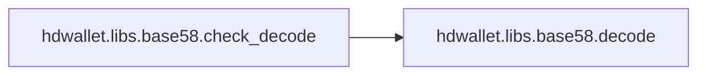

### Object Calls

* [hdwallet.libs.base58.decode](7-hdwallet_libs.md#hdwallet.libs.base58.decode)

<!---Documatic-block-hdwallet.libs.base58.check_decode-start--->
<details>
	<summary><code>hdwallet.libs.base58.check_decode</code> code snippet</summary>

```python
def check_decode(enc):
    dec = decode(enc)
    (raw, chk) = (dec[:-4], dec[-4:])
    if chk != sha256(sha256(raw).digest()).digest()[:4]:
        raise ValueError('base58 decoding checksum error')
    else:
        return raw
```
</details>
<!---Documatic-block-hdwallet.libs.base58.check_decode-end--->
<!---Documatic-section-check_decode-end--->

# #
<!---Documatic-section-hdwallet.libs.base58.check_decode-end--->

<!---Documatic-section-hdwallet.libs.ripemd160.ripemd160-start--->
## [hdwallet.libs.ripemd160.ripemd160](7-hdwallet_libs.md#hdwallet.libs.ripemd160.ripemd160)

<!---Documatic-section-ripemd160-start--->
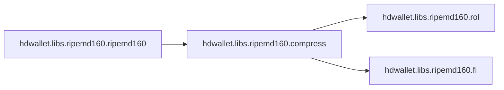

### Object Calls

* [hdwallet.libs.ripemd160.compress](7-hdwallet_libs.md#hdwallet.libs.ripemd160.compress)

<!---Documatic-block-hdwallet.libs.ripemd160.ripemd160-start--->
<details>
	<summary><code>hdwallet.libs.ripemd160.ripemd160</code> code snippet</summary>

```python
def ripemd160(data):
    state = (1732584193, 4023233417, 2562383102, 271733878, 3285377520)
    for b in range(len(data) >> 6):
        args = list(state) + [data[64 * b:64 * (b + 1)]]
        state = compress(*args)
    pad = b'\x80' + b'\x00' * (119 - len(data) & 63)
    fin = data[len(data) & ~63:] + pad + struct.pack('<Q', 8 * len(data))
    for b in range(len(fin) >> 6):
        args = list(state) + [fin[64 * b:64 * (b + 1)]]
        state = compress(*args)
    return b''.join((struct.pack('<L', h & 4294967295) for h in state))
```
</details>
<!---Documatic-block-hdwallet.libs.ripemd160.ripemd160-end--->
<!---Documatic-section-ripemd160-end--->

# #
<!---Documatic-section-hdwallet.libs.ripemd160.ripemd160-end--->

<!---Documatic-section-hdwallet.libs.bech32.bech32_encode-start--->
## [hdwallet.libs.bech32.bech32_encode](7-hdwallet_libs.md#hdwallet.libs.bech32.bech32_encode)

<!---Documatic-section-bech32_encode-start--->
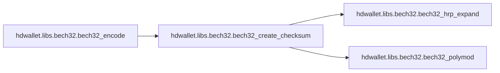

### Object Calls

* [hdwallet.libs.bech32.bech32_create_checksum](7-hdwallet_libs.md#hdwallet.libs.bech32.bech32_create_checksum)

<!---Documatic-block-hdwallet.libs.bech32.bech32_encode-start--->
<details>
	<summary><code>hdwallet.libs.bech32.bech32_encode</code> code snippet</summary>

```python
def bech32_encode(hrp, data):
    combined = data + bech32_create_checksum(hrp, data)
    return hrp + '1' + ''.join([CHARSET[d] for d in combined])
```
</details>
<!---Documatic-block-hdwallet.libs.bech32.bech32_encode-end--->
<!---Documatic-section-bech32_encode-end--->

# #
<!---Documatic-section-hdwallet.libs.bech32.bech32_encode-end--->

<!---Documatic-section-hdwallet.libs.bech32.encode-start--->
## [hdwallet.libs.bech32.encode](7-hdwallet_libs.md#hdwallet.libs.bech32.encode)

<!---Documatic-section-encode-start--->
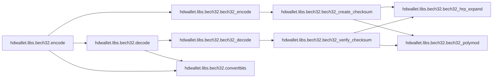

### Object Calls

* [hdwallet.libs.bech32.bech32_encode](7-hdwallet_libs.md#hdwallet.libs.bech32.bech32_encode)
* [hdwallet.libs.bech32.decode](7-hdwallet_libs.md#hdwallet.libs.bech32.decode)
* [hdwallet.libs.bech32.convertbits](7-hdwallet_libs.md#hdwallet.libs.bech32.convertbits)

<!---Documatic-block-hdwallet.libs.bech32.encode-start--->
<details>
	<summary><code>hdwallet.libs.bech32.encode</code> code snippet</summary>

```python
def encode(hrp, witver, witprog):
    ret = bech32_encode(hrp, [witver] + convertbits(witprog, 8, 5))
    if decode(hrp, ret) == (None, None):
        return None
    return ret
```
</details>
<!---Documatic-block-hdwallet.libs.bech32.encode-end--->
<!---Documatic-section-encode-end--->

# #
<!---Documatic-section-hdwallet.libs.bech32.encode-end--->

<!---Documatic-section-hdwallet.libs.bech32.bech32_decode-start--->
## [hdwallet.libs.bech32.bech32_decode](7-hdwallet_libs.md#hdwallet.libs.bech32.bech32_decode)

<!---Documatic-section-bech32_decode-start--->
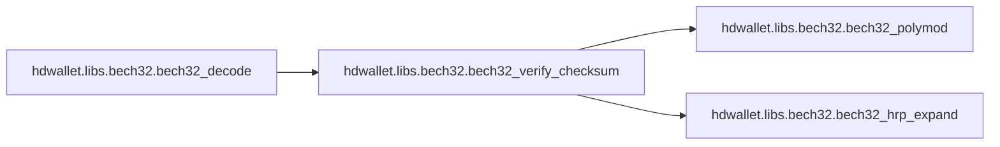

### Object Calls

* [hdwallet.libs.bech32.bech32_verify_checksum](7-hdwallet_libs.md#hdwallet.libs.bech32.bech32_verify_checksum)

<!---Documatic-block-hdwallet.libs.bech32.bech32_decode-start--->
<details>
	<summary><code>hdwallet.libs.bech32.bech32_decode</code> code snippet</summary>

```python
def bech32_decode(bech):
    if any((ord(x) < 33 or ord(x) > 126 for x in bech)) or (bech.lower() != bech and bech.upper() != bech):
        return (None, None)
    bech = bech.lower()
    pos = bech.rfind('1')
    if pos < 1 or pos + 7 > len(bech) or len(bech) > 90:
        return (None, None)
    if not all((x in CHARSET for x in bech[pos + 1:])):
        return (None, None)
    hrp = bech[:pos]
    data = [CHARSET.find(x) for x in bech[pos + 1:]]
    if not bech32_verify_checksum(hrp, data):
        return (None, None)
    return (hrp, data[:-6])
```
</details>
<!---Documatic-block-hdwallet.libs.bech32.bech32_decode-end--->
<!---Documatic-section-bech32_decode-end--->

# #
<!---Documatic-section-hdwallet.libs.bech32.bech32_decode-end--->

<!---Documatic-section-hdwallet.libs.bech32.decode-start--->
## [hdwallet.libs.bech32.decode](7-hdwallet_libs.md#hdwallet.libs.bech32.decode)

<!---Documatic-section-decode-start--->
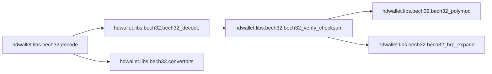

### Object Calls

* [hdwallet.libs.bech32.bech32_decode](7-hdwallet_libs.md#hdwallet.libs.bech32.bech32_decode)
* [hdwallet.libs.bech32.convertbits](7-hdwallet_libs.md#hdwallet.libs.bech32.convertbits)

<!---Documatic-block-hdwallet.libs.bech32.decode-start--->
<details>
	<summary><code>hdwallet.libs.bech32.decode</code> code snippet</summary>

```python
def decode(hrp, addr):
    (hrpgot, data) = bech32_decode(addr)
    if hrpgot != hrp:
        return (None, None)
    decoded = convertbits(data[1:], 5, 8, False)
    if decoded is None or len(decoded) < 2 or len(decoded) > 40:
        return (None, None)
    if data[0] > 16:
        return (None, None)
    if data[0] == 0 and len(decoded) != 20 and (len(decoded) != 32):
        return (None, None)
    return (data[0], decoded)
```
</details>
<!---Documatic-block-hdwallet.libs.bech32.decode-end--->
<!---Documatic-section-decode-end--->

# #
<!---Documatic-section-hdwallet.libs.bech32.decode-end--->

<!---Documatic-section-hdwallet.libs.base58.check_encode-start--->
## [hdwallet.libs.base58.check_encode](7-hdwallet_libs.md#hdwallet.libs.base58.check_encode)

<!---Documatic-section-check_encode-start--->
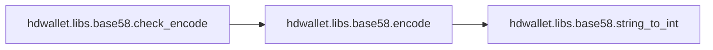

### Object Calls

* [hdwallet.libs.base58.encode](7-hdwallet_libs.md#hdwallet.libs.base58.encode)

<!---Documatic-block-hdwallet.libs.base58.check_encode-start--->
<details>
	<summary><code>hdwallet.libs.base58.check_encode</code> code snippet</summary>

```python
def check_encode(raw):
    chk = sha256(sha256(raw).digest()).digest()[:4]
    return encode(raw + chk)
```
</details>
<!---Documatic-block-hdwallet.libs.base58.check_encode-end--->
<!---Documatic-section-check_encode-end--->

# #
<!---Documatic-section-hdwallet.libs.base58.check_encode-end--->

<!---Documatic-section-hdwallet.libs.base58.checksum_encode-start--->
## [hdwallet.libs.base58.checksum_encode](7-hdwallet_libs.md#hdwallet.libs.base58.checksum_encode)

<!---Documatic-section-checksum_encode-start--->
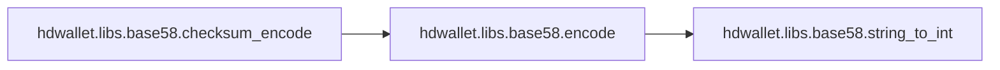

### Object Calls

* [hdwallet.libs.base58.encode](7-hdwallet_libs.md#hdwallet.libs.base58.encode)

<!---Documatic-block-hdwallet.libs.base58.checksum_encode-start--->
<details>
	<summary><code>hdwallet.libs.base58.checksum_encode</code> code snippet</summary>

```python
def checksum_encode(address, crypto='eth'):
    out = ''
    keccak = sha3.keccak_256()
    addr = address.lower().replace('0x', '') if crypto == 'eth' else address.lower().replace('xdc', '')
    keccak.update(addr.encode('ascii'))
    hash_addr = keccak.hexdigest()
    for (i, c) in enumerate(addr):
        if int(hash_addr[i], 16) >= 8:
            out += c.upper()
        else:
            out += c
    return '0x' + out if crypto == 'eth' else 'xdc' + out
```
</details>
<!---Documatic-block-hdwallet.libs.base58.checksum_encode-end--->
<!---Documatic-section-checksum_encode-end--->

# #
<!---Documatic-section-hdwallet.libs.base58.checksum_encode-end--->

<!---Documatic-section-hdwallet.libs.base58.ensure_string-start--->
## [hdwallet.libs.base58.ensure_string](7-hdwallet_libs.md#hdwallet.libs.base58.ensure_string)

<!---Documatic-section-ensure_string-start--->
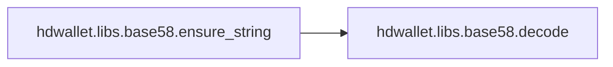

### Object Calls

* [hdwallet.libs.base58.decode](7-hdwallet_libs.md#hdwallet.libs.base58.decode)

<!---Documatic-block-hdwallet.libs.base58.ensure_string-start--->
<details>
	<summary><code>hdwallet.libs.base58.ensure_string</code> code snippet</summary>

```python
def ensure_string(data):
    if isinstance(data, six.binary_type):
        return data.decode('utf-8')
    elif not isinstance(data, six.string_types):
        raise ValueError('Invalid value for string')
    return data
```
</details>
<!---Documatic-block-hdwallet.libs.base58.ensure_string-end--->
<!---Documatic-section-ensure_string-end--->

# #
<!---Documatic-section-hdwallet.libs.base58.ensure_string-end--->

<!---Documatic-section-hdwallet.libs.ripemd160.compress-start--->
## [hdwallet.libs.ripemd160.compress](7-hdwallet_libs.md#hdwallet.libs.ripemd160.compress)

<!---Documatic-section-compress-start--->
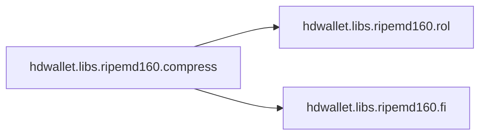

### Object Calls

* hdwallet.libs.ripemd160.rol
* hdwallet.libs.ripemd160.fi

<!---Documatic-block-hdwallet.libs.ripemd160.compress-start--->
<details>
	<summary><code>hdwallet.libs.ripemd160.compress</code> code snippet</summary>

```python
def compress(h0, h1, h2, h3, h4, block):
    (al, bl, cl, dl, el) = (h0, h1, h2, h3, h4)
    (ar, br, cr, dr, er) = (h0, h1, h2, h3, h4)
    x = [struct.unpack('<L', block[4 * i:4 * (i + 1)])[0] for i in range(16)]
    for j in range(80):
        rnd = j >> 4
        al = rol(al + fi(bl, cl, dl, rnd) + x[ML[j]] + KL[rnd], RL[j]) + el
        (al, bl, cl, dl, el) = (el, al, bl, rol(cl, 10), dl)
        ar = rol(ar + fi(br, cr, dr, 4 - rnd) + x[MR[j]] + KR[rnd], RR[j]) + er
        (ar, br, cr, dr, er) = (er, ar, br, rol(cr, 10), dr)
    return (h1 + cl + dr, h2 + dl + er, h3 + el + ar, h4 + al + br, h0 + bl + cr)
```
</details>
<!---Documatic-block-hdwallet.libs.ripemd160.compress-end--->
<!---Documatic-section-compress-end--->

# #
<!---Documatic-section-hdwallet.libs.ripemd160.compress-end--->

<!---Documatic-section-hdwallet.libs.bech32.bech32_verify_checksum-start--->
## [hdwallet.libs.bech32.bech32_verify_checksum](7-hdwallet_libs.md#hdwallet.libs.bech32.bech32_verify_checksum)

<!---Documatic-section-bech32_verify_checksum-start--->
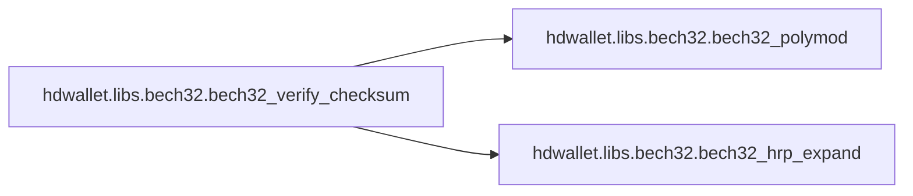

### Object Calls

* hdwallet.libs.bech32.bech32_polymod
* hdwallet.libs.bech32.bech32_hrp_expand

<!---Documatic-block-hdwallet.libs.bech32.bech32_verify_checksum-start--->
<details>
	<summary><code>hdwallet.libs.bech32.bech32_verify_checksum</code> code snippet</summary>

```python
def bech32_verify_checksum(hrp, data):
    return bech32_polymod(bech32_hrp_expand(hrp) + data) == 1
```
</details>
<!---Documatic-block-hdwallet.libs.bech32.bech32_verify_checksum-end--->
<!---Documatic-section-bech32_verify_checksum-end--->

# #
<!---Documatic-section-hdwallet.libs.bech32.bech32_verify_checksum-end--->

<!---Documatic-section-hdwallet.libs.bech32.convertbits-start--->
## [hdwallet.libs.bech32.convertbits](7-hdwallet_libs.md#hdwallet.libs.bech32.convertbits)

<!---Documatic-section-convertbits-start--->
<!---Documatic-block-hdwallet.libs.bech32.convertbits-start--->
<details>
	<summary><code>hdwallet.libs.bech32.convertbits</code> code snippet</summary>

```python
def convertbits(data, frombits, tobits, pad=True):
    acc = 0
    bits = 0
    ret = []
    maxv = (1 << tobits) - 1
    max_acc = (1 << frombits + tobits - 1) - 1
    for value in data:
        if value < 0 or value >> frombits:
            return None
        acc = (acc << frombits | value) & max_acc
        bits += frombits
        while bits >= tobits:
            bits -= tobits
            ret.append(acc >> bits & maxv)
    if pad:
        if bits:
            ret.append(acc << tobits - bits & maxv)
    elif bits >= frombits or acc << tobits - bits & maxv:
        return None
    return ret
```
</details>
<!---Documatic-block-hdwallet.libs.bech32.convertbits-end--->
<!---Documatic-section-convertbits-end--->

# #
<!---Documatic-section-hdwallet.libs.bech32.convertbits-end--->

<!---Documatic-section-hdwallet.libs.base58.encode-start--->
## [hdwallet.libs.base58.encode](7-hdwallet_libs.md#hdwallet.libs.base58.encode)

<!---Documatic-section-encode-start--->
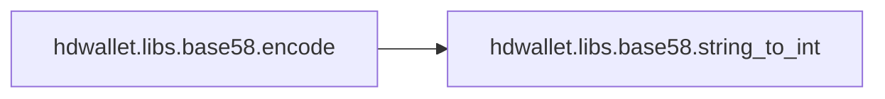

### Object Calls

* hdwallet.libs.base58.string_to_int

<!---Documatic-block-hdwallet.libs.base58.encode-start--->
<details>
	<summary><code>hdwallet.libs.base58.encode</code> code snippet</summary>

```python
def encode(data):
    enc = ''
    val = string_to_int(data)
    while val >= __base58_radix:
        (val, mod) = divmod(val, __base58_radix)
        enc = __base58_alphabet[mod] + enc
    if val:
        enc = __base58_alphabet[val] + enc
    n = len(data) - len(data.lstrip(b'\x00'))
    return __base58_alphabet[0] * n + enc
```
</details>
<!---Documatic-block-hdwallet.libs.base58.encode-end--->
<!---Documatic-section-encode-end--->

# #
<!---Documatic-section-hdwallet.libs.base58.encode-end--->

<!---Documatic-section-hdwallet.libs.bech32.bech32_create_checksum-start--->
## [hdwallet.libs.bech32.bech32_create_checksum](7-hdwallet_libs.md#hdwallet.libs.bech32.bech32_create_checksum)

<!---Documatic-section-bech32_create_checksum-start--->
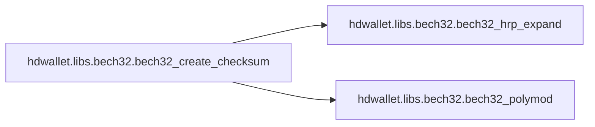

### Object Calls

* hdwallet.libs.bech32.bech32_hrp_expand
* hdwallet.libs.bech32.bech32_polymod

<!---Documatic-block-hdwallet.libs.bech32.bech32_create_checksum-start--->
<details>
	<summary><code>hdwallet.libs.bech32.bech32_create_checksum</code> code snippet</summary>

```python
def bech32_create_checksum(hrp, data):
    values = bech32_hrp_expand(hrp) + data
    polymod = bech32_polymod(values + [0, 0, 0, 0, 0, 0]) ^ 1
    return [polymod >> 5 * (5 - i) & 31 for i in range(6)]
```
</details>
<!---Documatic-block-hdwallet.libs.bech32.bech32_create_checksum-end--->
<!---Documatic-section-bech32_create_checksum-end--->

# #
<!---Documatic-section-hdwallet.libs.bech32.bech32_create_checksum-end--->

<!---Documatic-section-hdwallet.libs.base58.decode-start--->
## [hdwallet.libs.base58.decode](7-hdwallet_libs.md#hdwallet.libs.base58.decode)

<!---Documatic-section-decode-start--->
<!---Documatic-block-hdwallet.libs.base58.decode-start--->
<details>
	<summary><code>hdwallet.libs.base58.decode</code> code snippet</summary>

```python
def decode(data):
    if bytes != str:
        data = bytes(data, 'ascii')
    val = 0
    prefix = 0
    for c in data:
        val = val * __base58_radix + __base58_alphabet_bytes.find(c)
        if val == 0:
            prefix += 1
    dec = bytearray()
    while val > 0:
        (val, mod) = divmod(val, 256)
        dec.append(mod)
    dec.extend(bytearray(prefix))
    return bytes(dec[::-1])
```
</details>
<!---Documatic-block-hdwallet.libs.base58.decode-end--->
<!---Documatic-section-decode-end--->

# #
<!---Documatic-section-hdwallet.libs.base58.decode-end--->

[_Documentation generated by Documatic_](https://www.documatic.com)