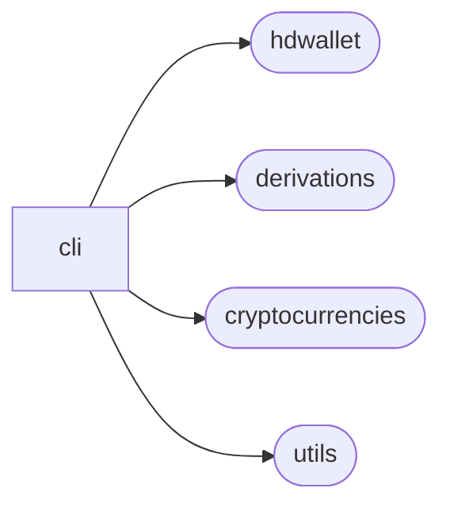
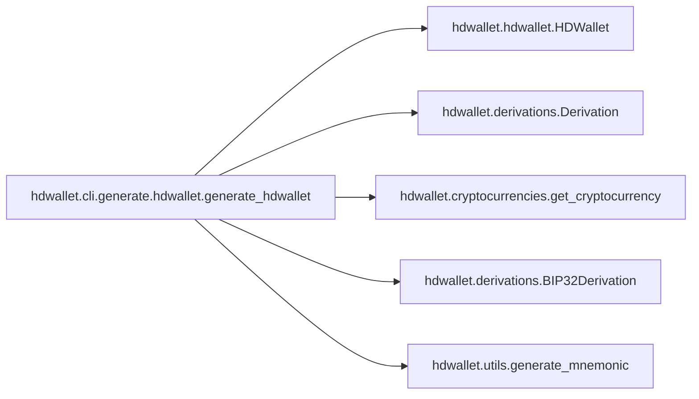
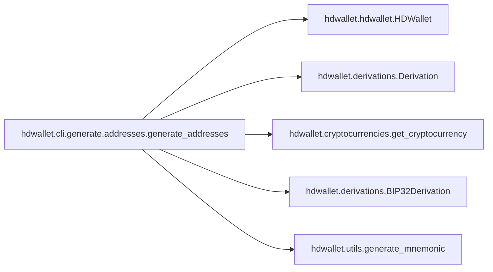

# Hdwallet Cli

[_Documentation generated by Documatic_](https://www.documatic.com)

<!---Documatic-section-Codebase Structure-start--->
## Codebase Structure

<!---Documatic-block-system_architecture-start--->

<!---Documatic-block-system_architecture-end--->

# #
<!---Documatic-section-Codebase Structure-end--->

<!---Documatic-section-hdwallet.cli.generate.hdwallet.generate_hdwallet-start--->
## [hdwallet.cli.generate.hdwallet.generate_hdwallet](8-hdwallet_cli.md#hdwallet.cli.generate.hdwallet.generate_hdwallet)

<!---Documatic-section-generate_hdwallet-start--->


### Object Calls

* [hdwallet.hdwallet.HDWallet](4-hdwallet_hdwallet.md#hdwallet.hdwallet.HDWallet)
* [hdwallet.derivations.Derivation](6-hdwallet_derivations.md#hdwallet.derivations.Derivation)
* [hdwallet.cryptocurrencies.get_cryptocurrency](5-hdwallet_cryptocurrencies.md#hdwallet.cryptocurrencies.get_cryptocurrency)
* [hdwallet.derivations.BIP32Derivation](6-hdwallet_derivations.md#hdwallet.derivations.BIP32Derivation)
* [hdwallet.utils.generate_mnemonic](3-hdwallet_utils.md#hdwallet.utils.generate_mnemonic)

<!---Documatic-block-hdwallet.cli.generate.hdwallet.generate_hdwallet-start--->
<details>
	<summary><code>hdwallet.cli.generate.hdwallet.generate_hdwallet</code> code snippet</summary>

```python
def generate_hdwallet(symbol: str, strength: Optional[int], entropy: Optional[str], mnemonic: Optional[str], language: Optional[str], passphrase: Optional[str], seed: Optional[str], xprivate_key: Optional[str], xpublic_key: Optional[str], strict: Optional[bool], account: int, change: bool, address: int, path: Optional[str], private_key: Optional[str], public_key: Optional[str], wif: Optional[str], semantic: str):
    try:
        hdwallet: HDWallet = HDWallet(symbol=symbol, semantic=semantic)
        if entropy:
            hdwallet.from_entropy(entropy=entropy, language=language, passphrase=passphrase)
        elif mnemonic:
            hdwallet.from_mnemonic(mnemonic=mnemonic, language=language, passphrase=passphrase)
        elif seed:
            hdwallet.from_seed(seed=seed)
        elif xprivate_key:
            hdwallet.from_xprivate_key(xprivate_key=xprivate_key, strict=strict)
        elif xpublic_key:
            hdwallet.from_xpublic_key(xpublic_key=xpublic_key, strict=strict)
        elif private_key:
            hdwallet.from_private_key(private_key=private_key)
        elif public_key:
            hdwallet.from_public_key(public_key=public_key)
        elif wif:
            hdwallet.from_wif(wif=wif)
        else:
            mnemonic = generate_mnemonic(language=language, strength=strength)
            hdwallet.from_mnemonic(mnemonic=mnemonic, language=language, passphrase=passphrase)
        if wif or private_key or public_key:
            pass
        elif path:
            derivation: Derivation = Derivation(path=path)
            hdwallet.from_path(path=derivation)
        else:
            cryptocurrency: Cryptocurrency = get_cryptocurrency(symbol=symbol)
            bip32_derivation: BIP32Derivation = BIP32Derivation(purpose=(44, False if xpublic_key else True), coin_type=(cryptocurrency.COIN_TYPE.INDEX, False if xpublic_key else cryptocurrency.COIN_TYPE.HARDENED), account=(account, False if xpublic_key else True), change=change, address=address)
            hdwallet.from_path(path=bip32_derivation)
        click.echo(json.dumps(hdwallet.dumps(), indent=4, ensure_ascii=False))
    except Exception as exception:
        click.echo(click.style(f'Error: {str(exception)}'), err=True)
        sys.exit()
```
</details>
<!---Documatic-block-hdwallet.cli.generate.hdwallet.generate_hdwallet-end--->
<!---Documatic-section-generate_hdwallet-end--->

# #
<!---Documatic-section-hdwallet.cli.generate.hdwallet.generate_hdwallet-end--->

<!---Documatic-section-hdwallet.cli.generate.addresses.generate_addresses-start--->
## [hdwallet.cli.generate.addresses.generate_addresses](8-hdwallet_cli.md#hdwallet.cli.generate.addresses.generate_addresses)

<!---Documatic-section-generate_addresses-start--->


### Object Calls

* [hdwallet.hdwallet.HDWallet](4-hdwallet_hdwallet.md#hdwallet.hdwallet.HDWallet)
* [hdwallet.derivations.Derivation](6-hdwallet_derivations.md#hdwallet.derivations.Derivation)
* [hdwallet.cryptocurrencies.get_cryptocurrency](5-hdwallet_cryptocurrencies.md#hdwallet.cryptocurrencies.get_cryptocurrency)
* [hdwallet.derivations.BIP32Derivation](6-hdwallet_derivations.md#hdwallet.derivations.BIP32Derivation)
* [hdwallet.utils.generate_mnemonic](3-hdwallet_utils.md#hdwallet.utils.generate_mnemonic)

<!---Documatic-block-hdwallet.cli.generate.addresses.generate_addresses-start--->
<details>
	<summary><code>hdwallet.cli.generate.addresses.generate_addresses</code> code snippet</summary>

```python
def generate_addresses(symbol: str, strength: int, entropy: Optional[str], mnemonic: Optional[str], language: Optional[str], passphrase: Optional[str], seed: Optional[str], xprivate_key: Optional[str], xpublic_key: Optional[str], strict: bool, account: int, change: bool, path: Optional[str], semantic: str, start_index: int, end_index: int, hardened: bool, show: str):
    try:
        hdwallet: HDWallet = HDWallet(symbol=symbol, semantic=semantic)
        if entropy:
            hdwallet.from_entropy(entropy=entropy, language=language, passphrase=passphrase)
        elif mnemonic:
            hdwallet.from_mnemonic(mnemonic=mnemonic, language=language, passphrase=passphrase)
        elif seed:
            hdwallet.from_seed(seed=seed)
        elif xprivate_key:
            hdwallet.from_xprivate_key(xprivate_key=xprivate_key, strict=strict)
        elif xpublic_key:
            hdwallet.from_xpublic_key(xpublic_key=xpublic_key, strict=strict)
        else:
            mnemonic = generate_mnemonic(language=language, strength=strength)
            hdwallet.from_mnemonic(mnemonic=mnemonic, language=language, passphrase=passphrase)
        for index in range(start_index, end_index):
            if path:
                derivation: Derivation = Derivation(path=path)
                derivation.from_index(index=index, hardened=hardened)
                hdwallet.from_path(path=derivation)
            else:
                cryptocurrency: Cryptocurrency = get_cryptocurrency(symbol=symbol)
                bip32_derivation: BIP32Derivation = BIP32Derivation(purpose=(44, False if xpublic_key else True), coin_type=(cryptocurrency.COIN_TYPE.INDEX, False if xpublic_key else cryptocurrency.COIN_TYPE.HARDENED), account=(account, False if xpublic_key else True), change=change, address=index)
                hdwallet.from_path(path=bip32_derivation)
            rows: str = ''
            dumps = hdwallet.dumps()
            for (i, key) in enumerate([keys.split(':') for keys in show.split(',')]):
                rows += f'{(dumps[key[0]][key[1]] if len(key) == 2 else dumps[key[0]])}' if i == 0 else f' {(dumps[key[0]][key[1]] if len(key) == 2 else dumps[key[0]])}'
            click.echo(rows)
            hdwallet.clean_derivation()
    except TimeoutError as exception:
        click.echo(click.style(f'Error: {str(exception)}'), err=True)
        sys.exit()
```
</details>
<!---Documatic-block-hdwallet.cli.generate.addresses.generate_addresses-end--->
<!---Documatic-section-generate_addresses-end--->

# #
<!---Documatic-section-hdwallet.cli.generate.addresses.generate_addresses-end--->

<!---Documatic-section-hdwallet.cli.list.cryptocurrencies.list_cryptocurrencies-start--->
## [hdwallet.cli.list.cryptocurrencies.list_cryptocurrencies](8-hdwallet_cli.md#hdwallet.cli.list.cryptocurrencies.list_cryptocurrencies)

<!---Documatic-section-list_cryptocurrencies-start--->
<!---Documatic-block-hdwallet.cli.list.cryptocurrencies.list_cryptocurrencies-start--->
<details>
	<summary><code>hdwallet.cli.list.cryptocurrencies.list_cryptocurrencies</code> code snippet</summary>

```python
def list_cryptocurrencies():
    (documents, table, headers) = ([], [], ['Cryptocurrency', 'Symbol', 'Mainnet', 'Testnet', 'Segwit', 'Coin Type', 'Default Path'])
    for (name, cryptocurrency) in inspect.getmembers(cryptocurrencies):
        if inspect.isclass(cryptocurrency):
            if issubclass(cryptocurrency, cryptocurrencies.Cryptocurrency) and cryptocurrency != cryptocurrencies.Cryptocurrency:
                if cryptocurrency.NETWORK == 'mainnet':
                    document: dict = {'name': cryptocurrency.NAME, 'symbol': cryptocurrency.SYMBOL, 'source_code': cryptocurrency.SOURCE_CODE, 'mainnet': 'Yes' if cryptocurrency.NETWORK == 'mainnet' else 'No', 'testnet': 'Yes' if cryptocurrency.NETWORK == 'testnet' else 'No', 'segwit': 'Yes' if cryptocurrency.SEGWIT_ADDRESS.HRP else 'No', 'coin_type': cryptocurrency.COIN_TYPE.INDEX, 'default_path': cryptocurrency.DEFAULT_PATH}
                    documents.append(document)
                elif cryptocurrency.NETWORK == 'testnet':
                    for (index, document) in enumerate(documents):
                        if document['name'] == cryptocurrency.NAME:
                            documents[index]['symbol'] = f"{document['symbol']}, {cryptocurrency.SYMBOL}"
                            documents[index]['testnet'] = 'Yes'
                else:
                    raise Exception('Invalid cryptocurrency network type.')
    for document in documents:
        table.append([document['name'], document['symbol'], document['mainnet'], document['testnet'], document['segwit'], document['coin_type'], document['default_path']])
    click.echo(tabulate(table, headers, tablefmt='github'))
```
</details>
<!---Documatic-block-hdwallet.cli.list.cryptocurrencies.list_cryptocurrencies-end--->
<!---Documatic-section-list_cryptocurrencies-end--->

# #
<!---Documatic-section-hdwallet.cli.list.cryptocurrencies.list_cryptocurrencies-end--->

<!---Documatic-section-hdwallet.cli.list.languages.list_languages-start--->
## [hdwallet.cli.list.languages.list_languages](8-hdwallet_cli.md#hdwallet.cli.list.languages.list_languages)

<!---Documatic-section-list_languages-start--->
<!---Documatic-block-hdwallet.cli.list.languages.list_languages-start--->
<details>
	<summary><code>hdwallet.cli.list.languages.list_languages</code> code snippet</summary>

```python
def list_languages():
    click.echo(tabulate([['Chinese Simplified'], ['Chinese Traditional'], ['English'], ['French'], ['Italian'], ['Japanese'], ['Korean'], ['Spanish']], ['Language'], tablefmt='github'))
```
</details>
<!---Documatic-block-hdwallet.cli.list.languages.list_languages-end--->
<!---Documatic-section-list_languages-end--->

# #
<!---Documatic-section-hdwallet.cli.list.languages.list_languages-end--->

[_Documentation generated by Documatic_](https://www.documatic.com)